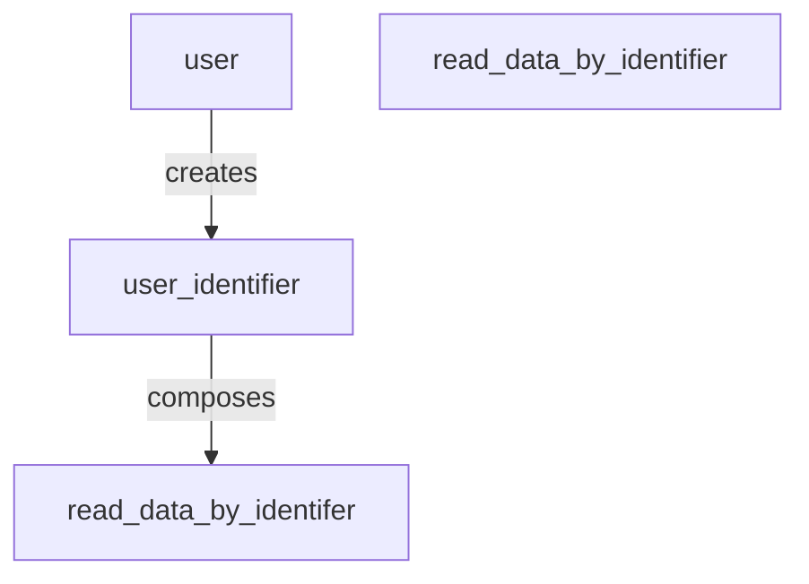

# Unified Diagnostics Services (UDS) Protocol

This library provides serialization and deserialization of UDS messages.
It is based on the ISO 14229-1:2020 standard.

## Usage

To start using the library, first you need to define any custom data types that you want the library to serialize and deserialize:

```rust
type MyDiagnosticRequest = Request<CustomIdentifier>;
```


